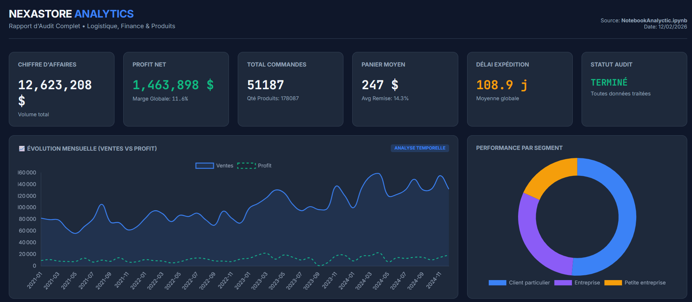

======================================
  NEXASTORE ANALYTICS — E-commerce Audit & Dashboard
================================================================================

  Author  : Redouane Hamecha — Data Analyst & IT Infrastructure
  Stack   : Python 3.9+ | Pandas | Jupyter | Chart.js
  Context : Academic portfolio project

  [ English version below / Version française plus bas ]

--------------------------------------------------------------------------------
  DESCRIPTION
--------------------------------------------------------------------------------

This project deploys a comprehensive data analysis pipeline transforming 51,000+ raw sales logs into strategic insights. To handle this complex dataset (encoding errors, missing values), I applied a rigorous cleaning strategy based on the 4 Pillars of Data Quality: Validity, Consistency, Uniqueness, and Completeness.

The architecture automates the full data lifecycle: from ingestion and normalization using Python (Pandas) to visualization. The final output is a serverless HTML Dashboard (Chart.js), providing an interactive, standalone interface to explore KPIs without requiring any technical setup or installation.

--------------------------------------------------------------------------------

### 📂 File Structure

| File | Description |
| :--- | :--- |
| **`NotebookAnalyctic.ipynb`** | **The core.** Data cleaning, EDA, and automated HTML dashboard generation. |
| **`DashboardNexaStore.html`** | **The output.** Interactive dashboard generated by the notebook (Chart.js, standalone). |
| **`Nexa_Store_Dataset_0_2.csv`** | **The source.** Raw transactional data with intentional errors for cleaning practice. |
| **`NotebookAnalyctic.html`** | **The static report.** Contains the full notebook analysis with code cells removed, preserving execution outputs. 👉 **[See it here](https://redouanehamecha.github.io/NexaStoreAnalyctic/NotebookAnalyctic)** |
| **`README.md`** | **The documentation.** Project overview, objectives, and technical explanations. |

--------------------------------------------------------------------------------
  METHODOLOGY
--------------------------------------------------------------------------------

  1. Data Cleaning
     - Corrupted encoding fix (e.g. \x92)
     - Type conversion (datetime, float)
     - Missing values & duplicate columns removal
     - Decimal separator normalization (comma -> dot)

  2. Exploratory Data Analysis (EDA)
     - Revenue, net profit, margins by category / sub-category
     - Breakdown by region, market segment, shipping mode
     - Logistics impact: shipping delay vs. profitability
     - Sales / Profit scatter plot per product (log scale)

  3. Dashboard Generation
     - Aggregated data injected as JSON into an HTML/JS template
     - Output is 100% self-contained (no Python needed to view it)

--------------------------------------------------------------------------------
  USAGE
--------------------------------------------------------------------------------

  # Install dependencies
  pip install pandas matplotlib seaborn numpy jupyter

  # Run the notebook
  jupyter notebook NotebookAnalyctic.ipynb

  To view the dashboard without running any code:
  -> Simply open         **[DashboardNexaStore](https://redouanehamecha.github.io/NexaStoreAnalyctic/)**

--------------------------------------------------------------------------------
  LINKS
--------------------------------------------------------------------------------

 **[GitHub Repository](https://github.com/RedouaneHamecha/NexaStoreAnalyctic)**

=============================================
  NEXASTORE ANALYTICS — Audit E-commerce & Dashboard          [ VERSION FR ]
================================================================================

  Auteur  : Redouane Hamecha — Data Analyst & Infrastructure IT
  Stack   : Python 3.9+ | Pandas | Jupyter | Chart.js
  Contexte : Projet portfolio académique

--------------------------------------------------------------------------------
  DESCRIPTION
--------------------------------------------------------------------------------

Ce projet déploie un pipeline d'analyse de données transformant 51 000+ logs de ventes bruts en insights stratégiques. Pour traiter ce jeu de données complexe (erreurs d'encodage, valeurs manquantes), j'ai appliqué un nettoyage rigoureux fondé sur les 4 piliers de la Data Quality : Validité, Cohérence, Unicité et Exhaustivité.

L'architecture du projet automatise le cycle de vie de la donnée : de l'ingestion et la normalisation via Python (Pandas) jusqu'à la restitution visuelle. Le livrable final est un Dashboard HTML serverless (Chart.js), offrant une interface interactive et autonome pour explorer les KPIs sans dépendance technique ni installation requise.

--------------------------------------------------------------------------------

### 📂 Fichiers

| Fichier | Description |
| :--- | :--- |
| **`NotebookAnalyctic.ipynb`** | **Le cerveau.** Nettoyage, EDA et génération automatique du dashboard HTML. |
| **`DashboardNexaStore.html`** | **Le résultat.** Dashboard interactif généré par le notebook (Chart.js, standalone). |
| **`Nexa_Store_Dataset_0_2.csv`** | **La source.** Données brutes transactionnelles avec erreurs volontaires pour l'exercice. |
| **`NotebookAnalyctic.html`** | **Le rapport statique** du fichier ipynb qui regroupe son intégralité en retirant uniquement les cellules de codes tout en conservant les output des exécution. 👉 **[Voir ici](https://redouanehamecha.github.io/NexaStoreAnalyctic/NotebookAnalyctic)** |
| **`README.md`** | **La documentation.** Vue d'ensemble du projet, objectifs et explications techniques. |

--------------------------------------------------------------------------------
  MÉTHODOLOGIE
--------------------------------------------------------------------------------

  1. Data Cleaning
     - Correction des encodages corrompus (ex. \x92)
     - Conversion de types (datetime, float)
     - Suppression des valeurs manquantes et colonnes dupliquées
     - Normalisation des séparateurs décimaux (virgule -> point)

  2. Analyse Exploratoire (EDA)
     - CA, profit net, marges par catégorie / sous-catégorie
     - Analyse par région, segment de marché, mode d'expédition
     - Impact logistique : délais d'expédition vs rentabilité
     - Scatter plot Ventes / Profit par produit (échelle log)

  3. Génération du Dashboard
     - Données agrégées injectées en JSON dans un template HTML/JS
     - Fichier HTML 100 % autonome (aucune installation pour le consulter)

--------------------------------------------------------------------------------
  UTILISATION
--------------------------------------------------------------------------------

  # Installer les dépendances
  pip install pandas matplotlib seaborn numpy jupyter

  # Lancer le notebook
  jupyter notebook NotebookAnalyctic.ipynb

  Pour consulter le dashboard sans exécuter de code :
  -> Ouvrir directement **[DashboardNexaStore](https://redouanehamecha.github.io/NexaStoreAnalyctic/)**

--------------------------------------------------------------------------------
  LIENS
--------------------------------------------------------------------------------

  **[GitHub Repository](https://github.com/RedouaneHamecha/NexaStoreAnalyctic)**

================================================================================
